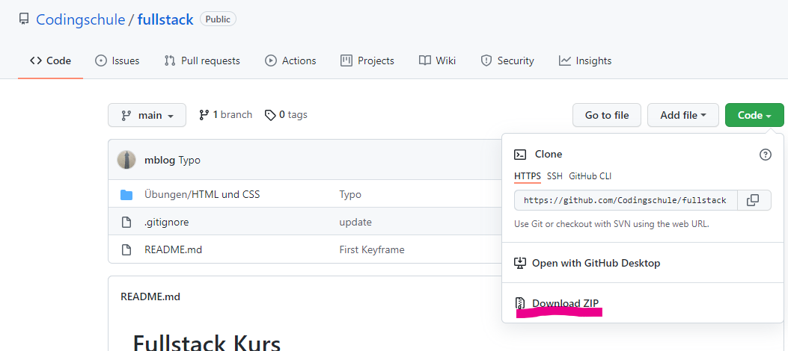
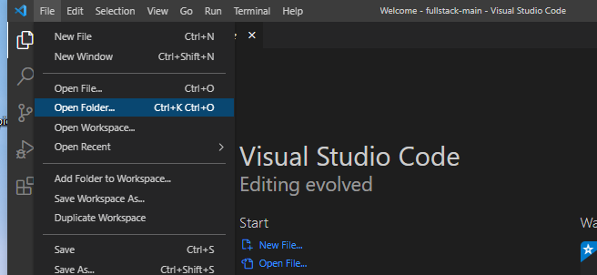
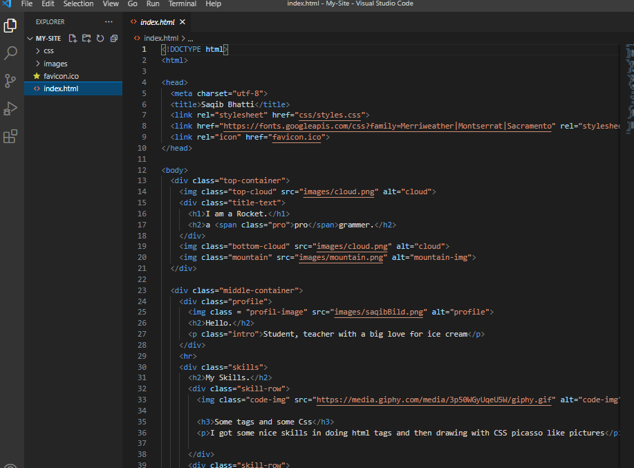
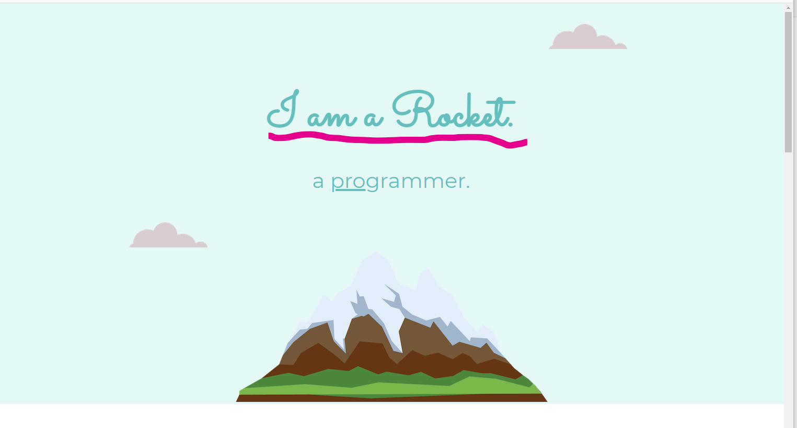
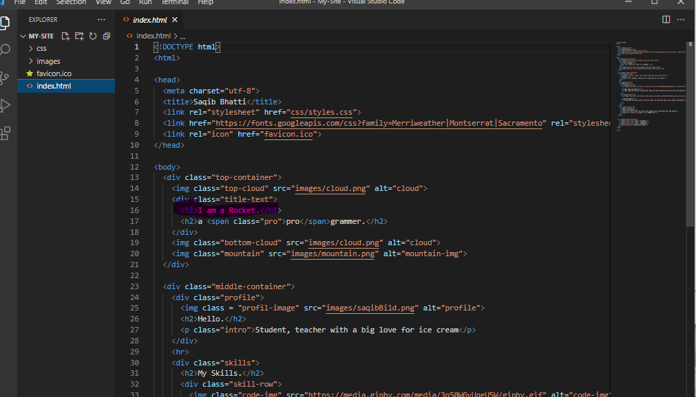

# Eigene "About us" Webseite
"About us / Über mich" Vorlage und Anpassung über Visual Studio Code

## Aufgaben
[index.html](./index.html)
* Gehe auf das Repository [Codingschule/fullstack](https://github.com/Codingschule/fullstack). Klicke dort auf den grünen Button (siehe Bild) um alle Dateien herunterzuladen. Entpacke nun die Zip-Datei *fullstack-main.zip*.

* Öffne den entpackten Ordner mit Visual Studio Code und wechsel in den Ordner **Übungen\HTML und CSS\MySite**. Alternativ kannst du auch direkt den untergeordneten Ordner **MySite** mit VS Code öffnen.   
   
Durch einen Klick auf die Datei **index.html** sollte sich die Datei im Editor öffnen.   

* Passe die Inhalte der **About us** Seite auf dich an. *Beispiel: Anpassung der Überschrift*
   
