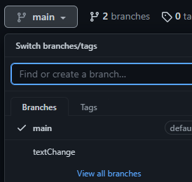

# Profile Card
## Git Übung/ GitHub Übung

Das Repository [course_profile](https://github.com/Codingschule/course_profile) beinhaltet eine HTML/CSS-Vorlage für eine sogenannte Profile Card.   
Diese Vorlage soll mit den eigenen Informationen befüllt werden.   

Themen und Befehle: *git, GitHub, Fork, Clone, Branch, Checkout, Commit, Push*

## Anleitung

1. Erzeuge einen Fork des bestehenden Repositories.  

2. Lade das Repository mit **clone** von deinem GitHub Account auf deinen Computer.   
`git clone https://github.com/mblog/course_profile.git`   

3. Erzeuge einen neuen Branch mit deinem Vornamen und wechsel in den neuen Branch.   
`git branch <vorname>`
`git checkout <vorname>`

4. Passe die Profile Card mit deinen Informationen an. Für die Anpassung der Icons könnt ihr die Plattform [Font Awesome](https://fontawesome.com/) nutzen.   
Bestätige die Änderungen mit einem Commit.
`git commit -am "Mein Profil`

5. Übertrage dein Änderungen auf GitHub.
`git push <vorname>`

6. Anschließend solltest du in GitHub einen neuen Branch sehen, der deine Änderungen enthält:   

Am Ende der Übung gibt es zwei Branches in eurem GitHub Repository. GitHub fragt euch nun, ob ihr den neuen Branch mit einem sogenannten **Pull Request** mit dem Main/Master Branch zusammenführen wollt, auch die Übertragung an das ursprüngliche Repository (Codingschule) ist möglich.
