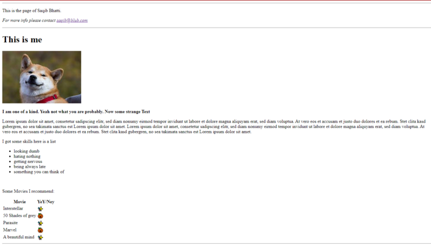
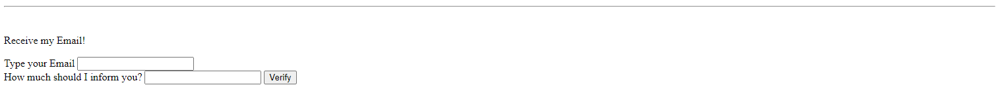

# Eine einfache Seite

Wir erstellen eine einfache Seite aus purem **html**. Professoren schätzen die Einfachheit und erzeugen ihre Seiten aus frontend Sicht manchmal nur aus einer **html**. Es wird folgend ein Beispiel dargestellt, jedoch sind weitere Beispiel einfach im Web findbar. Versuche zuerst nur mit Hilfe der Bilder und das eigene Googlen dir die entsprechenden **tags** und ihre Funktion zu erschließen, solltest du jedoch damit nicht zurecht kommen oder Hilfe brauchen, nutze je nach Eigenbedarf die *untenstehende Anleitung*. 

## Aufgaben 

1. Erstelle eine `index.html` mit dem entsprechenden **Boilercode**. Lege außerdem einen Ordner *img* an. In diesem werden die genutzten Bilder gespeichert.
   
2. Im `<head></head>`können Informationen wie der **title** geändert werden und ein [*favicon*](https://icons8.de/) durch das `<link...></link>` [**tag**](https://www.w3schools.com/html/html_favicon.asp) eingebunden werden.

3. Erzeuge nun die sogenannte *header-informationen* mit dem `<header></header>`. In diesem **tag** sind meistens Navigationslinks und Überschriften enthalten. 
*Vorsicht: Beachte, dass die Überschrift in dem Bildbeispiel erst im `<main></main>`eingebunden ist.

4. Im **main** Bereich sollen nun die Hauptinformationen der Seite angegeben werden. Mindestens erwartet ist eine Überschrift, Bild, ein kurzer Paragraph sowie eine ungeordnete Liste. Es können jedoch auch weitere Elemente wie eine *Tabelle* oder auch *Eingaben* ausprobiert werden. Die entsprechenden **tags** werden dieses Mal nicht vorgegeben. Aber diese [Übersicht-der-Tags](https://www.w3schools.com/TAGS/default.asp) und [Übersicht-Eingabe](https://www.w3schools.com/TAGS/tag_input.asp) können hilfreich sein.

5. Zuletzt soll mit einen `<footer></footer>`entsprechend eine *Copyright/Copyleft* mit *einem kurzem Paragraph ()* und *Linien drüber und drunter* ausgegeben werden (siehe Bild).

*Tipps:*
   - Jedes Tag (öffnend und schließend) nimmt einen bestimmten vertikalen und  horizontalen Platz ein. Möchte man zum Beispiel zwei Texte untereinander haben, sollten zwei `

`mit entsprechenden Text erstellt werden.
   - Die Meisten Tags haben sogenannte **attribute**. Es lohnt sich diese mit dem entsprechenden Tag zu googlen (vor allem bei Eingaben, Link-Tags und Image-Tags). Zum Beispiel ``. Das **src** stellt hier die sogenannte **source** *(Pfad zum Bild aus der Sicht der Datei, in der eingebunden wird)* , aus der das Bild geladen wird, da.
   - Statt `<header></header>`, `<main></main>`, `<footer></footer>`können auch `

` **tags** genutzt werden. Wir werden in der Zukunft mit dem `

` arbeiten.
   - mit *Rechtsklick -> untersuchen (auf der geöffneten **html**)* kann das gesamte **Dokument** auf die Struktur untersucht werden. Alternativ können sogenannte **Extension** wie **X-Ray Googles** oder **Pesticide** installiert werden.
