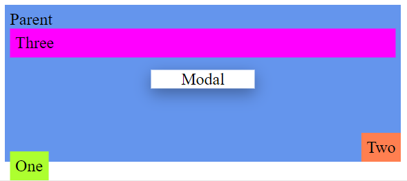

# CSS Position und Z-Index

Passe die vorliegen Webseite bzw. die Style Eigenschaften an. Die einzelnen Elemente sollen folgendermaßen plaziert werden:   
   
*Eine ungefähre Anordnung wie im Bild ist ausreichend*

## Aufgaben

1. Platziere das Elemente *One* am linken unteren Teil des Browserfensters. Beim Scrollen soll das Elemente an der Position im Fenster bleiben.

2. Das Element *Two* soll im sich rechts unten im Parentelement befinden.

3. Beim Scrollen soll das Element *Three* am oberen Bildschirmrand fixiert werden.

4. Das Element *Modal* soll mittig im Browserfenster plaziert werden. Beim Scrollen soll das Elemente an der Position im Fenster bleiben.