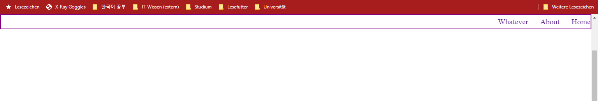

# Eine einfache Navigationsleiste

Erstelle eine einfache Navigationsleiste.

Es wird folgend etwas Code vorgegeben, damit die Elemente in der Navigationsleiste ausgerichtet sind. 

<pre>
.nav-bar {
    display: flex;
    justify-content: flex-end;
    align-items: center;
    gap: 2vw;
}
</pre>

Du kannst die untenstehenden Aufgaben als Anleitung nutzen oder auch nur mit Hilfe des Bilds diese Aufgabe bearbeiten. Versuche jedoch so wenig wie möglich die untenstehenden Aufgaben als Hilfestellung zu nehmen.

1. Erstelle die benötigten **html** Elemente. Du benötigst ein **nav**, in dem drei **li** mit jeweils einem **a** enthalten sind (verschachtelt). Vergebe dem entsprechenden **Attribute** im **a** jeweils erstmal ein *#* als Adresse.

2. Beachte, dass das **Document** bereits schon voreingestellte **CSS** hat. So hat jedes Element ein kleinen Abstand zum Rand (**Margin** ist überall auf einen **px** Wert schon voreingestellt). Das **Document** soll später scrollbar sein, es soll keinen Abstand geben und eine Schriftgröße für alle Elemente soll festgelegt werden (als Bezugsgröße).

3. Überlege nun welche Elemente du verändern musst (Schaue bei *Tipps* weiter unter, falls dir nichts dazu einfällt), sodass du entsprechend **class** **Attribute** vergibst.

4. Momentan haben die **li** Elemente alle noch Punkte. Wie kannst du diese entfernen?

5. Die in den **li** eingeschlossenen **a** haben noch den Unterstrich für einen *Hyperlink*. Gibt es hierfür eine *CSS-Eigenschaft* um dies zu ändern?

6. Füge nun deinem übergeordneten **nav** noch außerhalb des vorgegebenen Code weitere Eigenschaften hinzu: 
    - Die Navigationsbar soll auch beim Scrollen an der gleichen Stelle bleiben
    - Die Navigationsbar soll einen Rand haben
    - Die Navigationsbar soll 4 Prozent der sichtbaren Seitenhöhe einnehmen
    - Es gibt Browser die mit festen verankerten, scrollbaren Elementen Probleme haben. Ergänze noch eine passende **overflow** Eigenschaft mit entsprechendem **Value**.

*Tipps:*
   -  (Zu 4.) `<nav class="...">`
   -  (Zu 5.) [list-style](https://www.w3schools.com/css/css_list.asp)
   [underline](https://www.w3schools.com/cssref/pr_text_text-decoration.php)
   - (Zu 6.) `postion: ... ;` `height: ... ;`
