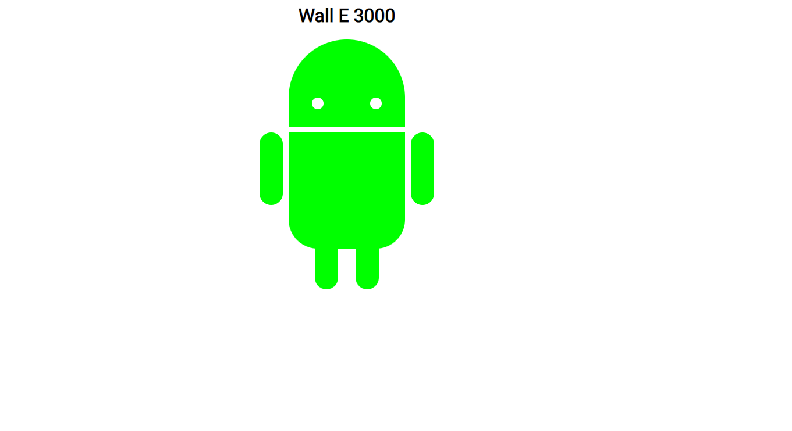
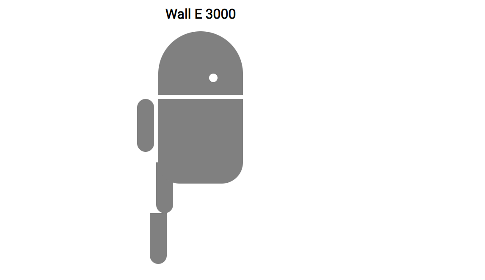
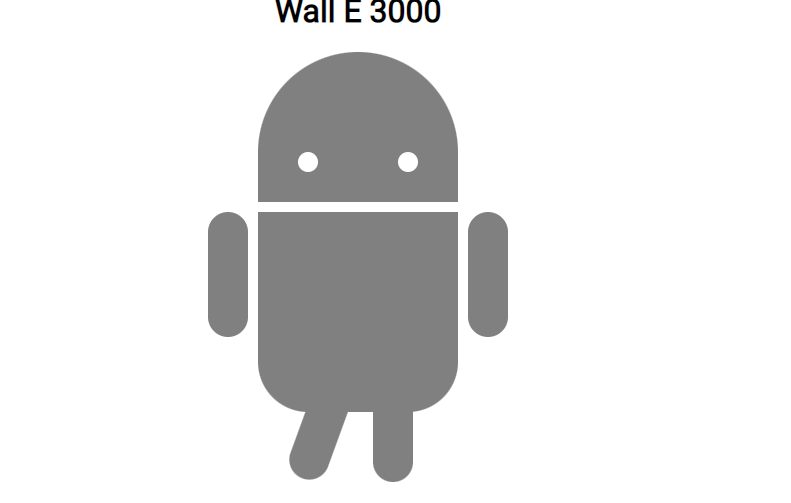
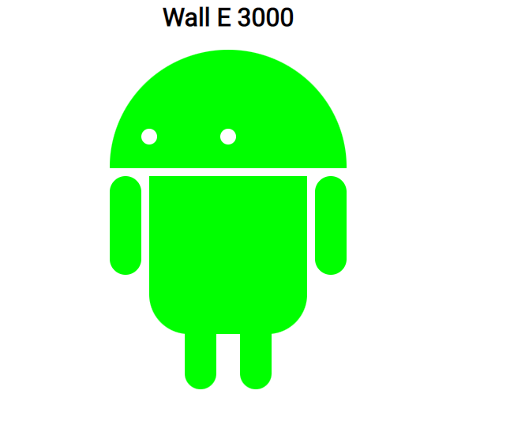

# You got a friend in me
"Robotfriend / Roboterfreund" Vorlage und Anpassung über Visual Studio Code

## Aufgaben
[index.html](./index.html)

* Der fertige Roboter soll wie auf dem Bild aussehen.   

* Schaue dir nun die **index.html** im Browser an. Du siehst, dass dem Roboter ein Auge, ein Arm und der Unterkörper fehlt. Schaue dir den Aufbau der **index.html** Datei an und versuche die Anordnung der Selektoren **class="xyz"** zu verstehen. Schaue danach auf die **style.css** Datei um die fehlende Bezeichnung für die Selektoren zu finden.   

* Wenn man über das linke Bein mit der Maus berührt (**hover**), sollte es um **20 Grad rotieren**. Wähle dafür den passenden Selektor im CSS und spezifiziere die entsprechende **Pseudoklasse**. Füge nun die entsprechende **Eigenschaft** hinzu.

* Ändere nun die Farbe des Roboters innerhalb der CSS auf **lime**.

* Wenn man mit der Maus über den Kopf fährt (**hover**), sollte der Kopf in die Breite gezogen werden. Füge die entsprechende **Pseudoklasse** zum entsprechenden **Selektor** hinzu. Ergänze dann die entsprechenden **CSS Eigenschaften** um den Kopf zu verbreitern und eine Transition einzubauen. Tipp: Die Eigenschaft **transition** im Internet nachschlagen.   
