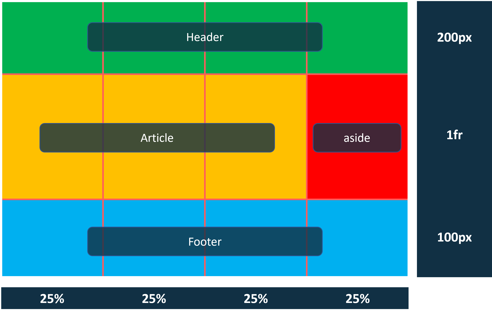

# Grid Layout

Mit Hilfe des CSS Grid Layouts lassen sich Elemente in einem Raster positionieren.

## Aufgabe

Überführe folgendes Layout in den passenden CSS Code. Nutze hierfür die Vorlage in diesem Ordner.

