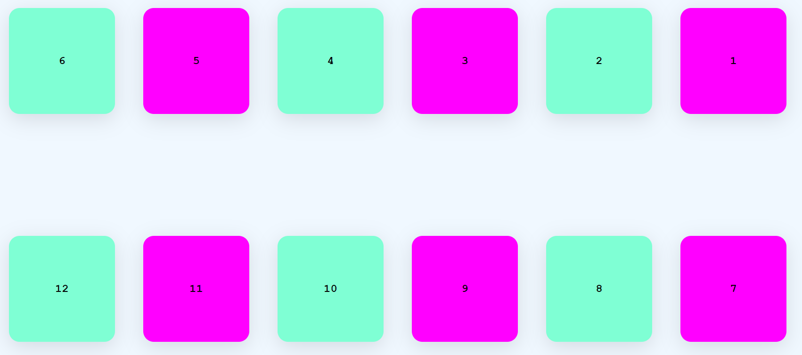
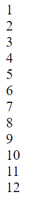
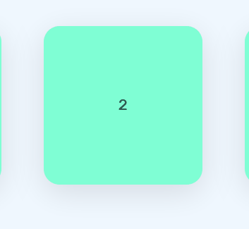

# Flexbox

Mit Hilfe des CSS Layouts Flexbox lassen sich Elemente (Items) anordnen.

```CSS
.parent {
    display: flex;
}
```
## Zielbild
   
*Je nach Bildschirmauflösung kann die Zahl der Element in einer Zeile abweichen.*

## Ausgangssituation



## Aufgaben

1. Im ersten Schritt konfigurieren wir verschiedene Eigenschaften des HTML Bodys.
    ```CSS
    body {
        font-family: 'Courier New', Courier, monospace;
        background-color: aliceblue;
        max-height: 100vh;
        margin: 0;
    }
    ```

2. Jedes DIV-Elemente mit einer Zahl (1-12) soll folgende CSS Eigenschaften erhalten. Überlege wie dies ohne die Anpassung der HTML Datei möglich ist.   
Eventuell hilft dir die Seite für die Lösung: https://www.w3schools.com/cssref/css_selectors.asp
    ```CSS
    box-shadow: rgba(100, 100, 111, 0.2) 0px 7px 29px 0px;
    text-align: center;  
    font-weight: 800;
    width: 150px;
    height: 150px;
    background-color: aquamarine;
    border-radius: 10%; 
    ```

3. Ordne die Elemente (1-12) folgendermaßen an:
  * Zeilenweise Anordnung mit Umbruch in eine neue Zeile, sofern die Elemente nicht ausreichend Platz haben. Zusätzlich sollen die Elemente in jeder Zeile rückwärts angeordnet werden.
  * Die Elemente (1-12) sollen einen Außenabstand von 20px zu allen Seiten haben.
  * Richte die Elemente (1-12) horizontal und vertikal zentriert aus. Die Elemente sollen mittig über den gesamten sichtbaren Bereich (ViewPort) platziert sein. **Beachte die Höhe des .parent Containers**

4. Ordner die Zahlen mittig im jeweiligen Element an.

5. Jedes zweite Element soll eine andere Hintergrundfarbe erhalten.
    ```CSS
    background-color: fuchsia;
    ```

6. Beim Berühren eines Elements (1-12) mit der Maus, soll dieses größer werden und sich um 180 Grad drehen. Zusätzlich soll die Veränderung in einem zeitlichen Verlauf von drei Sekunden erfolgen.   


7. Ändere den Mauszeiger in das Handsymbol 👆 beim Berühren eines Elements.

8. Zusätzlich zur Annimation soll ein Emoji ( *Windows Taste + .* ) zum Element hinzugefügt werden. *CSS Eigenschaft "content"*    
Wie könnte man die Zahl zusätzlich entfernen? *Mit Anpassung der HTML Datei*