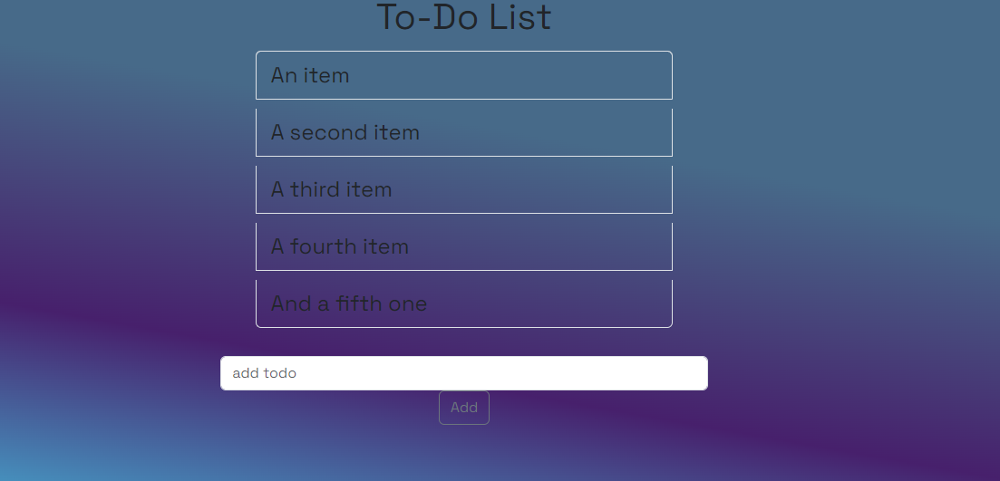

# Front-End (HTML/CSS/BOOTSTRAP) Todo-App
Wir erstellen einen statischen *Frontend-Prototyp* unserer Todo-App. Dabei kann das Design abweichen. 

Dabei wird hier jedoch keine Anleitung an sich mitgegeben, sondern ich ermutige dich möglichst eigenständig dieses Projekt durchzuführen. Unten stehen einige *Tipps*, die du nach Bedarf nutzen kannst zur Verfügung.

*Tipps*:
  * Reihenfolge: Binde zuerst die Bootstraplinks ein und dann dein eigenes **Stylesheet**
  * Erstelle einen **div** Container mit einer entsprechenden **class** für deine App
  * Die Bereiche wie *Überschrift*,*Todo-Liste*,*Eingabefeld und Button* sind in einzelne Container gegliedert
  * Für das Layout des *App-Containers* kann `display: flex;` mit `flex-direction: column;` verwendet werden. Beachte, dass die Ausrichtung sich dann nach der *Y-Achse* richtet!
  * Weitere CSS-Eigenschaften wie ein *Hover-Effekt* können bei Bedarf eingefügt werden

