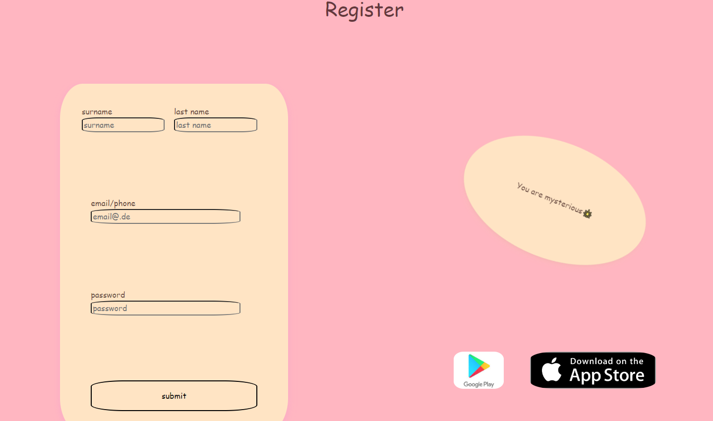
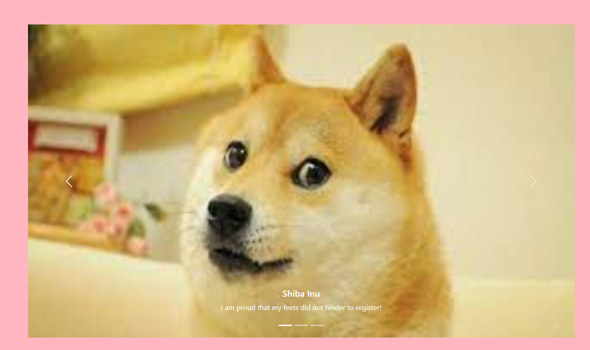
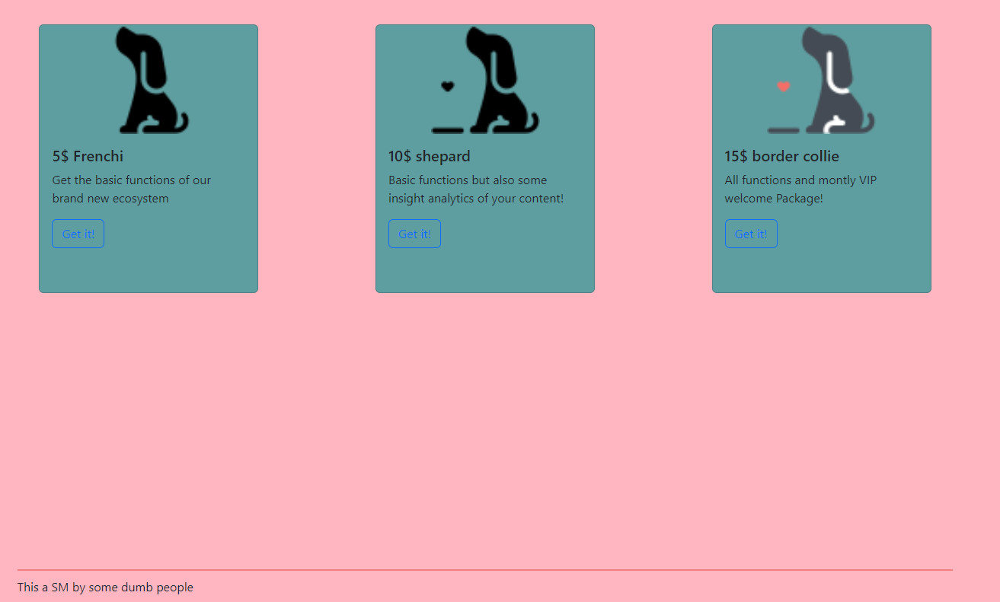

# Front-End (HTML/CSS/BOOTSTRAP) Eigene Seite

Erstelle nun eine eigene Seite, die von deinen Ideen inspiert ist. Ich möchte nur wenige grundlegende Sachen, welche Bestandteil der Seite sein sollen, vorgeben. Außerdem werde ich ein Beispiel für eine solche Seite zeigen.

## Vorgaben

- Die Webapp soll ein *Leitthema* verkörpern (z.B Social Media für Hunde).
- Die Webapp soll aus *mindestens zwei Seiten* mit jeweils voller Sichthöhe `height: 100vh` (oder mehr) bestehen.
- Das Layout der beiden Seiten soll *entweder* mit **grid** oder **flex** *oder* aus beiden bestehen. Weitere Komponenten (wie Karten) können natürlich auch mit dem Layoutmöglichkeiten zusammengesetzt werden
- Die Farben der Seite sollten aufeinander abgestimmt sein. Eine [Orientierung](https://coolors.co/palettes/trending) kann genutzt werden. Aber auch eigenes Nachschlagen kann hilfreich sein. 
- Eine der Seite soll auf jeden Fall eine Loginkomponente enthalten. Wie ausführlich (Email,Passwort,Nutzername...) du diese gestaltest sei dir überlassen.
- Es sollte eine eigene *Animation* auf der Webapp eingebaut sein.
- Es soll mindestens eine Komponente auf einer **Bootstrap**-Komponente aufgebaut sein. Diese soll auch mindestens durch eine **CSS-Eigenschaft** (als **class**/**inline**/**css-cheat**) angepasst werden.
- Es soll mindestens ein Bild eingebunden werden.

Nachfolgend möchte ich dir eine mögliche Webapp (kann auch gerne so nachgebaut werden) zeigen.

*Erste Seite (Store Links führen zu entsprechenden Seiten)*

*Zweite Seite (Carousel mit entsprechenden Slider)*

*Dritte Seite (Buttons "Get it!" führen zu keinen weiteren Seiten)*

